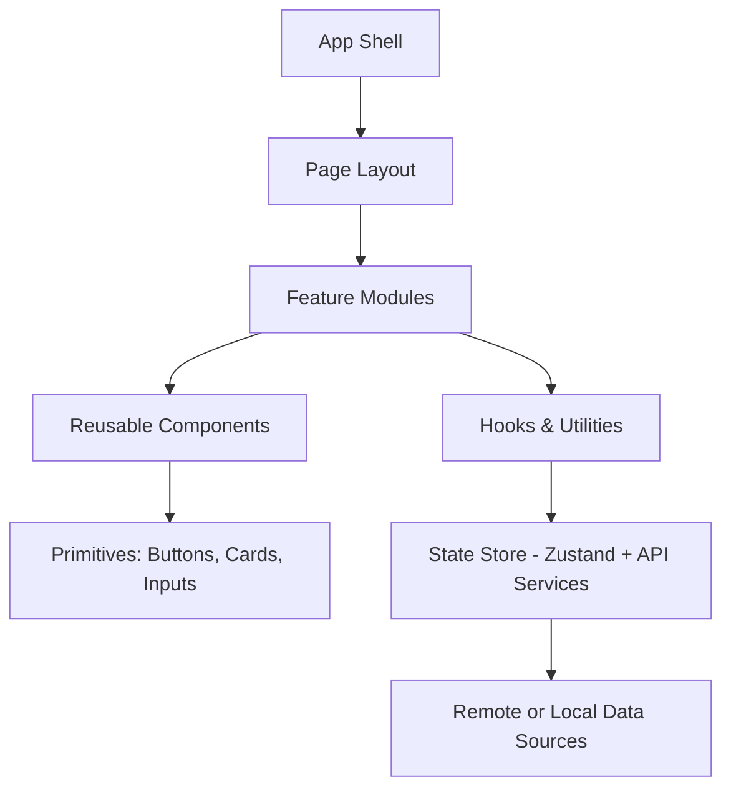
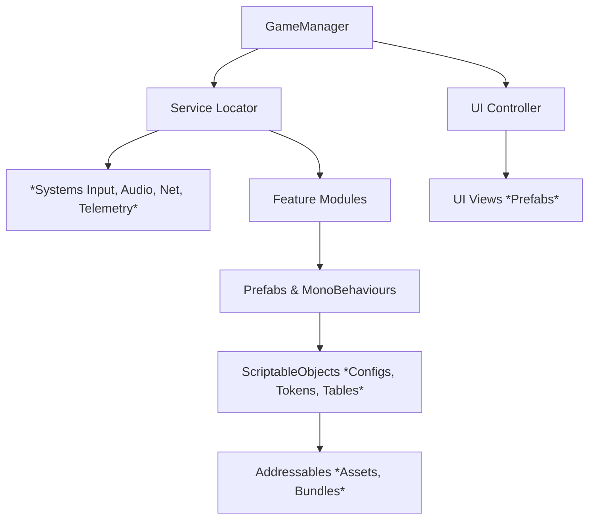

# Kingsmen Digital - Activation Guidelines

*Web (React + Vite) and Unity (URP)*

---

## 1) Introduction & Principles

**Goals**

- Build once, reuse across activations.
- Keep modules small, documented, and input-driven.
- Separate *data/config* from *presentation/behaviour*.
- Prefer composition over inheritance.

**Core principles**

1. **Clear boundaries**: feature modules don’t reach across layers directly.
2. **Data-driven**: visuals and behaviour read from config objects (web tokens, Unity ScriptableObjects).
3. **Replaceable I/O**: APIs, sensors, and content sources are abstracted behind services.
4. **Accessibility & performance by default**: sensible fallbacks, reduced-motion support, and profiling.

---

## 2) Shared Component Philosophy (Web ↔ Unity)

- **Tokens/Config**: Web uses design tokens (CSS variables/JS constants). Unity uses ScriptableObjects. Both are single sources of truth for colors, sizes, timings.
- **Prefabs/Components**: Unity Prefabs ↔ React components. Both accept config and emit events.
- **Services**: API/Device/Telemetry adapters are swappable.
- **Asset addressing**: Web uses conventional paths or CMS URLs; Unity uses Addressables labels.

---

## 3) Architecture Overview (Mermaid)

### Web Architecture (React + Vite)



### Unity Architecture (URP)



---

## 4) Web Guidelines - React + Vite (non-TS)

### 4.1 Folder Structure

```
/src
  /app
    App.jsx
    Routes.jsx
    Providers.jsx
  /features
    /gallery
      GalleryModule.jsx         # container/view
      useGallery.js             # feature hook
      galleryService.js         # data adapter
      galleryConfig.js          # defaults
      index.js
  /components
    /ui                         # primitives
      Button.jsx
      Card.jsx
      Icon.jsx
    /shared                     # reusable composites
      Carousel.jsx
      Modal.jsx
      StatTile.jsx
  /hooks
    useFetch.js
    useInterval.js
    useDevice.js
    usePrefersReducedMotion.js
  /state
    store.js                    # Zustand slices
  /services
    api.js                      # fetch wrapper
    telemetry.js                # analytics adapter
    devices.js                  # sensor/device I/O
  /styles
    tokens.css                  # CSS vars
    globals.css
  /three                        # 3D building blocks (R3F)
    Scene.jsx
    materials.js
    useSpring3d.js
  /utils
    cx.js
    clamp.js
    math.js
main.jsx
```

### 4.2 State Management (Zustand, minimal boilerplate)

**/state/store.js**

```jsx
import { create } from 'zustand';

export const useStore = create((set, get) => ({
  // slices
  ui: {
    theme: 'light',
    modal: null,
    setTheme: (theme) => set((s) => ({ ui: { ...s.ui, theme } })),
    openModal: (id) => set((s) => ({ ui: { ...s.ui, modal: id } })),
    closeModal: () => set((s) => ({ ui: { ...s.ui, modal: null } })),
  },
  data: {
    items: [],
    setItems: (items) => set((s) => ({ data: { ...s.data, items } })),
  },
  // selectors
  getTheme: () => get().ui.theme,
}));
```

**Usage**

```jsx
import { useStore } from '@/state/store';

export default function Header() {
  const theme = useStore((s) => s.ui.theme);
  const setTheme = useStore((s) => s.ui.setTheme);
  return (
    <header className={`header header--${theme}`}>
      <button onClick={() => setTheme(theme === 'light' ? 'dark' : 'light')}>
        Toggle theme
      </button>
    </header>
  );
}
```

### 4.3 Services (API wrapper)

**/services/api.js**

```jsx
const API_BASE = import.meta.env.VITE_API_BASE || '';

export async function api(path, opts = {}) {
  const res = await fetch(`${API_BASE}${path}`, {
    headers: { 'Content-Type': 'application/json', ...(opts.headers || {}) },
    ...opts,
  });
  if (!res.ok) throw new Error(`API ${res.status}: ${await res.text()}`);
  return res.json();
}
```

### 4.4 Common Utility Hooks

**/hooks/useFetch.js**

```jsx
import { useEffect, useState } from 'react';

export function useFetch(fn, deps = []) {
  const [data, setData] = useState(null);
  const [error, setError] = useState(null);
  const [loading, setLoading] = useState(true);
  useEffect(() => {
    let alive = true;
    setLoading(true);
    fn().then(
      (d) => alive && setData(d),
      (e) => alive && setError(e)
    ).finally(() => alive && setLoading(false));
    return () => { alive = false; };
  }, deps);
  return { data, error, loading };
}
```

**/hooks/usePrefersReducedMotion.js**

```jsx
import { useEffect, useState } from 'react';
export function usePrefersReducedMotion() {
  const [prefers, setPrefers] = useState(false);
  useEffect(() => {
    const mq = window.matchMedia('(prefers-reduced-motion: reduce)');
    setPrefers(mq.matches);
    const onChange = () => setPrefers(mq.matches);
    mq.addEventListener('change', onChange);
    return () => mq.removeEventListener('change', onChange);
  }, []);
  return prefers;
}
```

### 4.5 Design Tokens

**/styles/tokens.css**

```css
:root {
  --color-bg: #0b0f14;
  --color-surface: #121826;
  --color-primary: #6ce0ff;
  --color-accent: #ffe084;
  --radius: 16px;
  --space-1: 4px;
  --space-2: 8px;
  --space-3: 12px;
  --space-4: 16px;
  --elev-1: 0 2px 8px rgba(0,0,0,.2);
  --timing-fast: 150ms;
  --timing-base: 300ms;
}
[data-theme="light"] {
  --color-bg: #f7f8fa;
  --color-surface: #ffffff;
  --color-primary: #006cd8;
  --color-accent: #ff8a00;
}
```

**JS access to tokens (optional) - /styles/tokens.js**

```jsx
export const TOKENS = {
  radius: 16,
  spacing: [4,8,12,16],
  timing: { fast: 150, base: 300 }
};
```

### 4.6 Reusable Animation Patterns

**2D UI - Framer Motion**

```jsx
import { motion } from 'framer-motion';
import { usePrefersReducedMotion } from '@/hooks/usePrefersReducedMotion';

const fadeScale = { hidden:{opacity:0, scale:.98}, show:{opacity:1, scale:1} };

export function Card({ children }) {
  const reduce = usePrefersReducedMotion();
  return (
    <motion.divinitial="hidden"
      animate="show"
      transition={reduce ? { duration: 0 } : { duration: .3 }}
      variants={fadeScale}
      style={{ borderRadius:'var(--radius)', boxShadow:'var(--elev-1)' }}
      className="card"
    >
      {children}
    </motion.div>
  );
}
```

**3D - R3F + @react-spring/three**

```jsx
import { Canvas } from '@react-three/fiber';
import { a, useSpring } from '@react-spring/three';

function FloatingBox() {
  const { pos, rot } = useSpring({
    from: { pos:[0,0,0], rot:[0,0,0] },
    to: async (next) => {
      while (1) {
        await next({ pos:[0, .2, 0], rot:[0, .2, 0] });
        await next({ pos:[0, 0, 0], rot:[0, 0, 0] });
      }
    },
    config: { mass:1, tension:80, friction:12 }
  });
  return (
    <a.mesh position={pos} rotation={rot}>
      <boxGeometry args={[1,1,1]} />
      <meshStandardMaterial color="hotpink" />
    </a.mesh>
  );
}

export default function Scene() {
  return (
    <Canvas camera={{ position:[2,2,3] }}>
      <ambientLight intensity={0.6} />
      <directionalLight position={[3,3,3]} />
      <FloatingBox />
    </Canvas>
  );
}
```

### 4.7 Example Reusable Component (copy-ready)

**/components/ui/Button.jsx**

```jsx
export default function Button({ as:'button', variant='primary', size='md', ...props }) {
  const Tag = props.href ? 'a' : 'button';
  const styles = {
    base: {
      borderRadius: 'var(--radius)',
      padding: size === 'lg' ? '12px 16px' : '8px 12px',
      border: 'none',
      cursor: 'pointer',
      transition: `transform var(--timing-fast), opacity var(--timing-fast)`,
    },
    primary: { background: 'var(--color-primary)', color: '#0b0f14' },
    ghost:   { background: 'transparent', color: 'var(--color-primary)', outline: '1px solid var(--color-primary)' }
  };
  return (
    <Tag
      {...props}
      style={{ ...styles.base, ...(styles[variant] || styles.primary) }}
      onMouseDown={(e) => e.currentTarget.style.transform = 'scale(0.98)'}
      onMouseUp={(e) => e.currentTarget.style.transform = 'scale(1)'}
    />
  );
}

```

---

## 5) Unity Guidelines - URP

### 5.1 Directory Organization

```
Assets/
  _Project/
    _Settings/                      # URP, Input, Layers, Addressables profiles
    _Shared/
      ScriptableObjects/            # tokens, configs, tables
      Prefabs/                      # UI primitives, controls
      Materials/
      Shaders/
      Audio/
    Core/
      Runtime/
        Systems/                    # InputSystem, Telemetry, AudioService...
        Services/                   # APIClient, ContentProvider
        Utils/
        ServiceLocator.cs
        GameManager.cs
      Editor/
    Features/
      Gallery/
        Scripts/
        Prefabs/
        Configs/
      Sensors/
        Scripts/
        Prefabs/
        Configs/
    UI/
      Prefabs/
      Fonts/
      Sprites/
  AddressableAssetsData/            # auto-managed by Addressables
```

**Assembly Definitions**

Create `.asmdef` per top folder (`Core`, `Features/Gallery`, `UI`) to speed compile and control references. Features depend on `Core`, not each other.

### 5.2 Shared Configuration Files (ScriptableObjects)

**ThemeTokens.asset**

Colors, spacing, timing, typography.

**EndpointConfig.asset**

Base URL, timeouts, environment flags.

**InputMap.asset**

Actions for kiosk/gesture/gamepad variants.

**Example: Tokens ScriptableObject**

```csharp
using UnityEngine;

[CreateAssetMenu(menuName = "Config/ThemeTokens")]
public class ThemeTokens : ScriptableObject {
    public Color Background = new Color(0.05f, 0.07f, 0.1f);
    public Color Surface = new Color(0.07f, 0.09f, 0.15f);
    public Color Primary = new Color(0.42f, 0.88f, 1.0f);
    public float Radius = 16f;
    public float TimingFast = .15f;
    public float TimingBase = .30f;
}

```

### 5.3 Component-Based Prefab Reuse

- **UI primitives**: `UIButton`, `UICard`, `UICarouselItem`.
- **Composites**: `Modal`, `Carousel`, `HUD`.
- **Feature prefabs** are assemblies of primitives + feature scripts, exposing a small public API via serialized fields and events.

**Example: Reusable UIButton**

```csharp
using UnityEngine;
using UnityEngine.UI;
using UnityEngine.Events;

[RequireComponent(typeof(Button))]
public class UIButton : MonoBehaviour {
    public UnityEvent OnClick;
    [SerializeField] private Image bg;
    [SerializeField] private Text label;
    [SerializeField] private ThemeTokens theme;

    void Awake() {
        var btn = GetComponent<Button>();
        btn.onClick.AddListener(() => OnClick?.Invoke());
        ApplyTheme();
    }

    public void SetText(string text) { if (label) label.text = text; }
    public void SetPrimary(bool on) { if (bg) bg.color = on ? theme.Primary : theme.Surface; }

    void ApplyTheme() {
        if (!bg || !theme) return;
        bg.color = theme.Surface;
    }
}
```

### 5.4 Data-Driven Design with ScriptableObjects

**Feature Config SO**

```csharp
using UnityEngine;

[CreateAssetMenu(menuName = "Feature/GalleryConfig")]
public class GalleryConfig : ScriptableObject {
    public string AddressablesLabel;   // e.g. "gallery_images"
    public int ItemsPerPage = 6;
    public float AutoAdvanceSeconds = 8f;
}
```

**Feature Controller using Config**

```csharp
using UnityEngine;
using UnityEngine.AddressableAssets;
using UnityEngine.ResourceManagement.AsyncOperations;
using System.Collections.Generic;

public class GalleryController : MonoBehaviour {
    [SerializeField] private GalleryConfig config;
    [SerializeField] private Transform gridParent;
    [SerializeField] private GameObject galleryItemPrefab;

    private readonly List<GameObject> pooled = new();

    void Start() {
        LoadAssets(config.AddressablesLabel);
        InvokeRepeating(nameof(NextPage), config.AutoAdvanceSeconds, config.AutoAdvanceSeconds);
    }

    void LoadAssets(string label) {
        Addressables.LoadAssetsAsync<Texture2D>(label, tex => {
            var go = Instantiate(galleryItemPrefab, gridParent);
            var view = go.GetComponent<GalleryItemView>();
            view.SetTexture(tex);
            pooled.Add(go);
        }).Completed += (AsyncOperationHandle<IList<Texture2D>> op) => {
            // handle done
        };
    }

    void NextPage() {
        // simple paging logic using pooled items
    }
}
```

### 5.5 Addressables Conventions

- **Labels** per feature (`gallery_images`, `voices_en`, `models_lowpoly`).
- **Groups** by update cadence (static vs frequently updated).
- **Warmup** critical assets in splash scene using Addressables `DownloadDependenciesAsync(label)`.

### 5.6 Service Locator (thin, testable)

```csharp
public interface IApiClient { System.Threading.Tasks.Task<string> GetJson(string path); }
public interface ITelemetry { void Track(string evt, params (string, object)[] props); }

public static class Services {
    public static IApiClient Api { get; private set; }
    public static ITelemetry Telemetry { get; private set; }
    public static void Register(IApiClient api, ITelemetry tel) { Api = api; Telemetry = tel; }
}
```

**GameManager bootstraps services**

```csharp
using UnityEngine;

public class GameManager : MonoBehaviour {
    [SerializeField] private ThemeTokens theme;

    void Awake() {
        Application.targetFrameRate = 60;
        Services.Register(new HttpApiClient(), new UnityTelemetry());
    }
}
```

### 5.7 Example MonoBehaviour Template (copy-ready)

```csharp
using UnityEngine;

/// <summary>
/// Drop this on a Prefab to create a reusable building block.
/// Reads config from ScriptableObjects. Emits UnityEvents or C# events.
/// </summary>
public class StatTile : MonoBehaviour {
    [SerializeField] private ThemeTokens theme;
    [SerializeField] private string label;
    [SerializeField] private float value;

    public void Set(string newLabel, float newValue) { label = newLabel; value = newValue; Redraw(); }
    void OnEnable() => Redraw();

    void Redraw() {
        // Update TMPro text, colours from theme, simple tween via DOTween/LeanTween if present
    }
}
```

---

## 6) Setup Instructions

### Web (Vite + React)

```bash
npm create vite@latest kiosk -- --template react
cd kiosk
npm i zustand framer-motion @react-three/fiber three @react-spring/three
npm i -D vite-plugin-svgr
```

- Add aliases in `vite.config.js` for `@` → `/src`.
- Import `tokens.css` in `main.jsx`.
- Wrap app providers in `/app/providers.jsx` (store, telemetry, theme).

### Unity

- Create URP project.
- Install **Addressables** via Package Manager.
- Create `ThemeTokens`, `GalleryConfig`.
- Create `_Project/_Shared/Prefabs` for primitives and `Features/...` for feature prefabs.
- Configure Addressables groups and labels.
- Add **Splash** scene for warmup, **Main** scene for content.

---

## 7) Example Module Blueprints

### Web Feature Blueprint

```
/features/<feature>/
  <Feature>Module.jsx      # container/view, uses hooks + components
  use<Feature>.js          # business logic hook
  <feature>Service.js      # data I/O (api, local)
  <feature>Config.js       # defaults and schema
  index.js                 # export surface
```

**index.js**

```jsx
export { default as Gallery } from './GalleryModule.jsx';
export * from './useGallery.js';
```

### Unity Feature Blueprint

```
/Features/<Feature>/
  Scripts/
    <Feature>Controller.cs
    <Feature>Signals.cs
  Prefabs/
    <Feature>.prefab
    UI_<Feature>Panel.prefab
  Configs/
    <Feature>Config.asset
```

---

## 8) Project Delivery Using Git

### 8.1. Web Delivery Using Git

### 8.1.1 Recommended Git Workflow

Use a simple, consistent branching model across all web exhibits:

- `main`
    - Always production ready
    - Only tested and approved code
- `develop` (optional for small projects, recommended for larger ones)
    - Integration branch for features that are ready for QA
- `feature/*`
    - One branch per task or ticket
    - Example: `feature/EXH-001-space-vitals-attractor-animation`

### Repository structure

At minimum:

- One Git repo per exhibit web experience
    - Example repo name: `EXH-001-space-vitals-web`
- Standard folders inside the repo:
    - `/src` – main application code
    - `/public` or `/static` – static assets
    - `/scripts` – helper scripts (build, deploy)
    - `/docs` – technical notes, environment setup, API docs
    - `/build` or `/dist` – generated build artifacts (usually not committed to Git)

### Where to host web Git repos

Preferred options:

1. **GitHub (free private repos)**
    - Free private repos for small teams
    - Easy to integrate with common CI tools

### Handling build artifacts

Build artifacts should not live inside the Git repo long term. Instead:

- Create builds locally or via CI
- Name them with exhibit code, version, and date
    - Example: `EXH-001-space-vitals-web-v1.2.0-2025-11-20.zip`
- Store the zipped build in a shared location such as:
    - SharePoint document library for the project
    - OneDrive folder under the corresponding exhibit root
- Optionally, create a Git tag on `main` for each approved build
    - Example: `v1.2.0` matching the build zip

### 8.1.2. How developers should commit and push

- Pull `develop` (or `main` if not using `develop`) before starting work
- Create a feature branch:
    
    ```bash
    git checkout develop
    git pull
    git checkout -b feature/EXH-001-space-vitals-attractor-animation
    ```
    
- Commit small, logical chunks with clear messages:
    
    ```bash
    git add .
    git commit -m "EXH-001: Add attractor animation on home screen"
    ```
    
- Push feature branches regularly:
    
    ```bash
    git push origin feature/EXH-001-space-vitals-attractor-animation
    ```
    
- Open a Pull Request (PR) into `develop` (optional)
- Once reviewed and approved, merge into `develop` (optional)
- When the QA version is ready, merge `develop` into `main` with a release tag

### 8.1.3. How to prepare a build for QA

1. Ensure the latest code is merged into `develop`
2. Pull `develop` locally:
    
    ```bash
    git checkout develop
    git pull
    ```
    
3. Run tests and linting (if configured)
4. Run the build command, for example:
    
    ```bash
    npm install
    npm run build
    ```
    
5. Zip the contents of the build output folder (`/build` or `/dist`)
6. Name the file:
    
    ```
    EXH-001-space-vitals-web-QA-v1.2.0-2025-11-20.zip
    ```
    
7. Upload to:
    - `EXH-001-space-vitals/web/builds/qa/` on SharePoint, OneDrive, or Google Drive
8. Update the QA notes or ticket with:
    - Git commit hash
    - Git tag (if used)
    - Link to the QA build zip

### 8.1.4. How to prepare a build for final delivery to the client

1. Merge the tested QA branch into `main`
2. Tag the commit, for example:
    
    ```bash
    git checkout main
    git pull
    git merge develop
    git tag v1.2.0
    git push origin main --tags
    ```
    
3. Build again from `main`:
    
    ```bash
    npm install
    npm run build
    ```
    
4. Zip the build output folder
5. Name it clearly, for example:
    
    ```
    EXH-001-space-vitals-web-PROD-v1.2.0-2025-11-25.zip
    ```
    
6. Upload to:
    - `EXH-001-space-vitals/web/builds/prod/` on SharePoint, OneDrive, or Google Drive
7. Share package by:
    - Sending a SharePoint/OneDrive/Google Drive link
    - Or delivering via the agreed secure method
8. Log the delivery in the project documentation, with:
    - Version and tag
    - Link to the build
    - Date and responsible person

---

### 8.2. Delivery System for Large Unity Projects

### 8.2.1. Why standard Git is problematic for Unity

Unity projects include many large binary files:

- Textures, audio, and video
- Large scene files
- Generated Library folders

Problems when using plain Git only:

- Repos become very large and slow to clone
- Binary diffs do not compress well
- Hosting limits can be hit quickly if large assets are committed often

### 8.2.2. Recommended hybrid approach

Use a hybrid approach:

- **Git** for:
    - Scripts (`Assets/Scripts`)
    - Scene and prefab metadata (normal Unity project files, excluding Library and Builds)
    - Project settings
- **Shared drive storage** for:
    - Large source assets (high resolution textures, raw audio, video)
    - Build outputs
    - Milestone snapshots of the full Unity project

Preferred storage:

- SharePoint, OneDrive, or Google Drive under the exhibit’s root folder
- Reference links to these assets should be added in the README file

### 8.2.3. Unity project root and Git setup

**Project root location (local machine):**

- Developers keep a local folder such as:
    
    ```
    D:\Projects\EXH-001-space-vitals-unity\
    ```
    
- This folder is a Git repository that contains the Unity project

**Git repo contents:**

- Include:
    - `Assets/`
    - `ProjectSettings/`
    - `Packages/`
- Exclude (via `.gitignore`):
    - `Library/`
    - `Temp/`
    - `Logs/`
    - `Obj/`
    - `Builds/` or `Build/`
    - Any large cache or generated folders

Provide a standard `.gitignore` :

```
[Ll]ibrary/
[Tt]emp/
[Oo]bj/
[Bb]uilds/
[Bb]uild/
[Ll]ogs/
MemoryCaptures/
UserSettings/
```

### 8.2.4. Storing and syncing large files and builds

Inside SharePoint, OneDrive or Google Drive:

- Under the exhibit root, create:
    
    ```
    EXH-001-space-vitals/
      unity/
        builds/
        project-snapshots/
        large-assets/
    ```
    

Use these folders as follows:

- `unity/builds/`
    - Zipped Unity builds per platform
    - Naming example:
        - `EXH-001-space-vitals-unity-PROD-PC-v1.0.0-2025-11-25.zip`
        - `EXH-001-space-vitals-unity-QA-PC-v0.9.0-2025-11-20.zip`
- `unity/project-snapshots/`
    - Zipped full Unity project at important milestones (e.g., pre-UAT, pre-launch)
    - Naming example:
        - `EXH-001-space-vitals-unity-project-snapshot-pre-UAT-2025-11-10.zip`
- `unity/large-assets/`
    - Original large media files or content packs that are not committed to Git
    - Developers sync these as needed

### 8.2.5. Onboarding a new Unity developer

1. **Access**
    - Ensure the developer has access to:
        - Git host (Azure DevOps or GitHub)
        - SharePoint/OneDrive exhibit folder
2. **Clone the Git repo**
    
    ```bash
    git clone <repo-url> EXH-001-space-vitals-unity
    cd EXH-001-space-vitals-unity
    ```
    
3. **Download latest project snapshot (if available)**
    - From `unity/project-snapshots/` on SharePoint, OneDrive, or Google Drive
    - Unzip the snapshot into the cloned repo folder
    - Overwrite existing files if needed
4. **Download large asset packs**
    - From `unity/large-assets/`
    - Place them in the correct folder inside `Assets/` or as documented in `README.md`
5. **Open in Unity**
    - Open the project in the agreed Unity version
    - Let Unity import assets and generate `Library/` locally (this folder remains untracked)
6. **Start work using feature branches**
    - Create branches similar to the web workflow:
        
        ```bash
        git checkout -b feature/EXH-001-space-vitals-crop-animation
        ```
        

### 8.2.6. Preparing and delivering a Unity build to a client

1. Ensure target branch (usually `develop` or `main`) is up to date:
    
    ```bash
    git checkout main
    git pull
    ```
    
2. Open the project in Unity and confirm:
    - Scenes in build settings are correct
    - Configurations match the target environment (resolution, kiosk settings)
3. Create a build:
    - Build to a local `Builds/` folder that is ignored by Git
    - Example folder: `Builds/PC/` or `Builds/Android/`
4. Test the build locally:
    - Verify critical flows and stability
5. Zip the build folder:
    - Example filename:
        
        ```
        EXH-001-space-vitals-unity-PROD-PC-v1.0.0-2025-11-25.zip
        ```
        
6. Upload to SharePoint, OneDrive,  or Google Drive:
    - Place the zip in `EXH-001-space-vitals/unity/builds/prod/`
7. Document the delivery:
    - Add an entry to a delivery log in `unity/documentation/`:
        - Version
        - Target platform
        - Date
        - Git commit hash
        - Link to build
8. Share with the client:
    - Provide a SharePoint/OneDrive/Google Drive link
    - Include any run instructions (e.g., “run `SpaceVitals.exe` in full screen mode on 4K display”)

---

### 8.3. Project Folder Naming Pattern

Use a consistent naming pattern for all exhibit-related folders and repositories:

```
[Exhibit ID]-[Exhibit Name in Kebab Case]
```

Where:

- `Exhibit ID` is an agreed code, such as `EXH-001`
- `Exhibit Name in Kebab Case` is:
    - Lowercase
    - Spaces replaced by “**-”**
    - No special characters

Examples:

- `EXH-001-space-vitals`
- `EXH-002-space-nursery`
- `EXH-010-garden-crops`
- `EXH-011-garden-soil`
- `EXH-020-space-mission-briefing`

Use this pattern consistently for:

- **Root folders** on SharePoint, OneDrive, or Google Drive
    - Example: `Projects/EXH-001-space-vitals/`
- **Git repository names**
    - Example web repo: `EXH-001-space-vitals-web`
    - Example Unity repo: `EXH-001-space-vitals-unity`
- **Unity project folders and build folders**
    - Example Unity project root: `EXH-001-space-vitals-unity/`
    - Example build folder (inside shared drive): `EXH-001-space-vitals/unity/builds/prod/`

This pattern makes it easy to search, filter, and cross-reference exhibits across tools.

---

## 8.4. Recommended Folder Structure Example

Below is a simple shared drive structure for one exhibit:

```
EXH-001-space-vitals/
  web/
    repo/                  # Local or synced working copy of Git repo (optional mirror)
    builds/
      qa/
      prod/
    documentation/
      release-notes.md
      deployment-instructions.md

  unity/
    project/               # Optional synced project view or README pointing to Git repo
    builds/
      qa/
      prod/
    project-snapshots/
    large-assets/
    documentation/
      delivery-log.md
      hardware-specs.md

  shared/
    reference/
      creative-brief/
      design-assets/
      client-branding/
    client-deliverables/
      EXH-001-space-vitals-web/
      EXH-001-space-vitals-unity/
```

Notes:

- The **Git repo itself** is usually hosted on Azure DevOps or GitHub.
- The `web/repo/` and `unity/project/` folders can either:
    - Contain a synced working copy of the repo, or
    - Contain a `README.md` that links to the repo and explains how to clone it

---

## 9) Maintenance & Collaboration Tips

- **Naming**: `FeatureThing`, `IServiceName`, `Config.asset`.
- **Docs**: Add a `README.md` per feature with inputs/outputs and a GIF.
- **Lint**: Prettier/ESLint for web; Unity code style via `.editorconfig`.
- **CI smoke**: Web build + lint; Unity batch mode compile + Addressables check.
- **Version assets**: Addressables labels use semantic tags (`gallery@v2`).
- **Performance**:
    - Web: memoize heavy components, lazy-load routes, limit R3F draw calls.
    - Unity: static batching where possible, URP forward renderer, pool objects.
- **Accessibility**:
    - Web: ARIA labels, keyboard focus ring, `prefers-reduced-motion`.
    - Unity: large hit targets, readable contrast, audio captions when applicable.

## 10) Quick Copy Templates

**React Feature Starter**

```bash
# create-feature.sh (pseudo)
mkdir -p src/features/$1
cat > src/features/$1/${1^}Module.jsx <<'EOF'
export default function MODULE() {
  return <section role="region" aria-label="MODULE">Hello MODULE</section>;
}
EOF
```

**Unity ScriptableObject Starter**

```csharp
using UnityEngine;
#if UNITY_EDITOR
using UnityEditor;
#endifpublic class SimpleConfig : ScriptableObject {
    public string Id;
    public float Duration = 1f;
}

#if UNITY_EDITOR
public static class SimpleConfigFactory {
    [MenuItem("Assets/Create/Config/SimpleConfig")]
    public static void Create() {
        var asset = ScriptableObject.CreateInstance<SimpleConfig>();
        AssetDatabase.CreateAsset(asset, "Assets/_Project/_Shared/ScriptableObjects/SimpleConfig.asset");
        AssetDatabase.SaveAssets();
        Selection.activeObject = asset;
    }
}
#endif
```

---

## 11) What “Reusable” Looks Like (Checklist)

- Accepts **config** as props/fields, not hardcoded values.
- Emits **events** instead of mutating external state.
- Has **no direct asset references** that aren’t injected (web: props/urls; Unity: Addressables).
- Has **README** + example usage.
- Passes **lint/style** checks and **builds cleanly**.
- For Unity: prefab overrides stay minimal; use variant prefabs for per-activation tweaks.
- For Web: visual style driven by tokens; supports reduced motion.